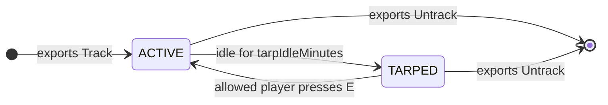

# Vehicle Tarp

`vehicle_tarp` persists vehicles server-side and hides idle ones under a translucent tarp that only the players you allow can see and uncover.

## How it works

Once a vehicle is handed to the resource, it is tracked in one of two states:

| State    | What it means                                                                                                                                                                                                                    |
| -------- | -------------------------------------------------------------------------------------------------------------------------------------------------------------------------------------------------------------------------------- |
| `ACTIVE` | The vehicle entity exists in the world and drives normally.                                                                                                                                                                      |
| `TARPED` | After `tarpIdleMinutes` with nobody in it, the real entity is deleted server-side and replaced client-side by a translucent prop, drawn **only** for the players your access resolver allows. Everyone else sees nothing at all. |

An allowed player standing within `untarpDistance` of a tarp presses `[E]` to uncover it. The vehicle respawns with its saved state re-applied: position, heading, health, fuel, mods, colours, extras, doors, windows and tyres.

## What you have to wire up


{% column width="50%" %}
### 1. Tracking

Call `exports.vehicle_tarp:Track` from your garage, dealership or spawn code once the vehicle exists. See [Tracking a vehicle](tracking-a-vehicle.md).


{% column width="50%" %}
### 2. Access

Write `ServerConfig.canAccess` to decide who sees and uncovers a tarp. See [Access model](access-model.md).



Everything else works out of the box. When your garage stores a vehicle back, or a player is wiped, call [`Untrack`](untracking-a-vehicle.md) to drop it from the system.

## Where to go next

<table data-view="cards"><thead><tr><th></th><th></th><th></th><th data-hidden data-card-target data-type="content-ref"></th></tr></thead><tbody><tr><td><h3><i class="fa-download" style="color:$primary;">:download:</i></h3></td><td><strong>Installation</strong></td><td>Dependencies, start order, database, admin permissions</td><td><a href="installation.md">installation.md</a></td></tr><tr><td><h3><i class="fa-location-crosshairs" style="color:$primary;">:location-crosshairs:</i></h3></td><td><strong>Tracking a vehicle</strong></td><td>The <code>Track</code> export, and what <code>ownerSource</code> does</td><td><a href="tracking-a-vehicle.md">tracking-a-vehicle.md</a></td></tr><tr><td><h3><i class="fa-link-slash" style="color:$primary;">:link-slash:</i></h3></td><td><strong>Untracking a vehicle</strong></td><td>The <code>Untrack</code> export, its filter, and what it leaves behind</td><td><a href="untracking-a-vehicle.md">untracking-a-vehicle.md</a></td></tr><tr><td><h3><i class="fa-key" style="color:$primary;">:key:</i></h3></td><td><strong>Access model</strong></td><td><code>canAccess</code>, render distance, key-item refresh, admin logging</td><td><a href="access-model.md">access-model.md</a></td></tr><tr><td><h3><i class="fa-sliders" style="color:$primary;">:sliders:</i></h3></td><td><strong>Configuration</strong></td><td>Every key in <code>config/shared.lua</code>, plus the convars</td><td><a href="configuration.md">configuration.md</a></td></tr><tr><td><h3><i class="fa-terminal" style="color:$primary;">:terminal:</i></h3></td><td><strong>Commands</strong></td><td>Admin commands, the staff map, the diagnostic overlay</td><td><a href="commands.md">commands.md</a></td></tr></tbody></table>

## Dependencies


**`oxmysql` is the only hard requirement** - without it the resource will not start. **`ox_lib` is recommended but not required**: it is what lets a tarped vehicle keep its colours, extras, doors, windows and tyres. Everything else is optional.


| Dependency             | Required?    | With it                                                                                                                       | Without it                                                                                                                                                              |
| ---------------------- | ------------ | ----------------------------------------------------------------------------------------------------------------------------- | ----------------------------------------------------------------------------------------------------------------------------------------------------------------------- |
| `oxmysql`              | **Required** | -                                                                                                                             | The resource will not start                                                                                                                                             |
| `ox_lib`               | Recommended  | Full vehicle snapshot: colours, extras, doors, windows, tyres, and the ox\_lib `[E]` help text                                | Reduced snapshot, and the help text falls back to the native prompt                                                                                                     |
| `qbx_core` / `qb-core` | Optional     | Owner identity is the `citizenid`, notifications go through the framework, admin commands use the framework permission groups | Standalone mode: owner identity is the player's `license:` identifier, notifications go through `chat:addMessage`, admin commands use the ACE principal `command.vtarp` |
| `ox_inventory`         | Optional     | `accessRefreshItems` refreshes tarp visibility the instant a key item changes hands                                           | Visibility refreshes on the reconcile poll only                                                                                                                         |

Detection is automatic at resource start. There is no config flag to pick a mode.
