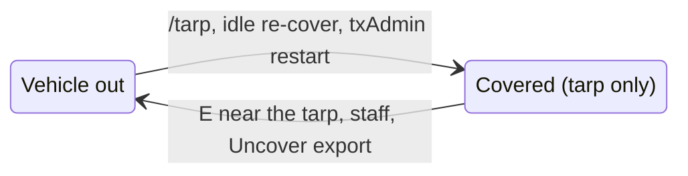

# Vehicle Tarp

`vehicle_tarp` lets players cover a parked vehicle with a tarp. A covered vehicle is **removed from the world**: only the tarp stays, and only the players you allow can see it and uncover it.


**100% standalone.** The only hard dependency is `oxmysql`. ESX, QBCore and QBox are detected automatically, and every link to another script (keys, inventory, garage, vehicle script) is a small function you write in `config/server.lua`.


## How it works

| Step         | What happens                                                                                                                                                                             |
| ------------ | ---------------------------------------------------------------------------------------------------------------------------------------------------------------------------------------- |
| **Cover**    | A player on foot runs `/tarp` next to an empty, stopped vehicle. The position is saved, damage is written to the vehicle table, and the vehicle is deleted. A tarp prop takes its place. |
| **See**      | Every 2 seconds, the server checks which nearby tarps each player may see. A player without access receives nothing: no prop, no data.                                                   |
| **Uncover**  | Within 3 m, the player presses `E` ("Uncover vehicle ID #12"). The vehicle is recreated under the tarp with its customs, read back from the framework vehicle table.                     |
| **Re-cover** | An uncovered vehicle left unused for 30 minutes is covered again automatically - never while someone is in it or next to it.                                                             |

Tarps survive resource restarts and server reboots (table `vehicle_tarp`, created automatically).


Only vehicles **registered in the framework vehicle table** can be covered (`player_vehicles` on QBox / QBCore, `owned_vehicles` on ESX). Customs are not copied: they are always read back from that table.


## Requirements

| Dependency                             | Required?    | Why                                                                                                                       |
| -------------------------------------- | ------------ | ------------------------------------------------------------------------------------------------------------------------- |
| `oxmysql`                              | **Required** | Tarp records and the vehicle table. Without it, covering and uncovering are disabled.                                     |
| `qbx_core` / `qb-core` / `es_extended` | Optional     | Detected automatically. Picks the vehicle table and the props format. Any other framework works with `preset = 'custom'`. |
| txAdmin                                | Optional     | Needed only for _cover on restart_.                                                                                       |

## Documentation

<table data-view="cards"><thead><tr><th></th><th></th><th></th><th data-hidden data-card-target data-type="content-ref"></th></tr></thead><tbody><tr><td><h3><i class="fa-download" style="color:$primary;">:download:</i></h3></td><td><strong>Installation</strong></td><td>Running in six steps.</td><td><a href="installation.md">installation.md</a></td></tr><tr><td><h3><i class="fa-key" style="color:$primary;">:key:</i></h3></td><td><strong>Access</strong></td><td>Who sees, uncovers and covers a tarp.</td><td><a href="access-model.md">access-model.md</a></td></tr><tr><td><h3><i class="fa-terminal" style="color:$primary;">:terminal:</i></h3></td><td><strong>Commands</strong></td><td>Player, staff and debug commands.</td><td><a href="commands.md">commands.md</a></td></tr><tr><td><h3><i class="fa-code" style="color:$primary;">:code:</i></h3></td><td><strong>Exports and events</strong></td><td>Plug in your garage or interaction script.</td><td><a href="exports-and-events.md">exports-and-events.md</a></td></tr><tr><td><h3><i class="fa-sliders" style="color:$primary;">:sliders:</i></h3></td><td><strong>Configuration</strong></td><td>Every option of <code>config/shared.lua</code> and <code>config/server.lua</code>.</td><td><a href="configuration.md">configuration.md</a></td></tr><tr><td><h3><i class="fa-puzzle-piece" style="color:$primary;">:puzzle-piece:</i></h3></td><td><strong>Examples</strong></td><td>Ready-to-copy setups: QBox, ox_inventory, mVehicle, ox_target, ESX.</td><td><a href="examples/">examples</a></td></tr></tbody></table>
